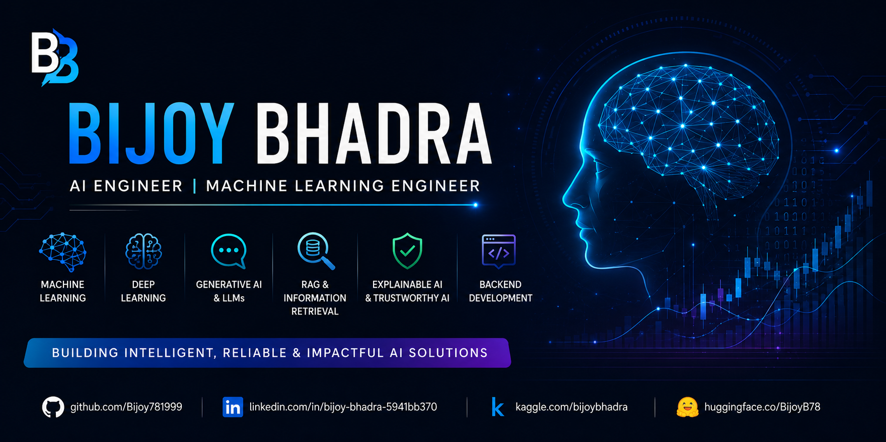
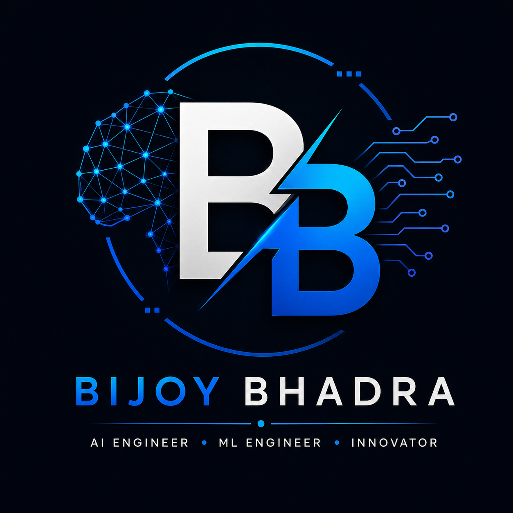
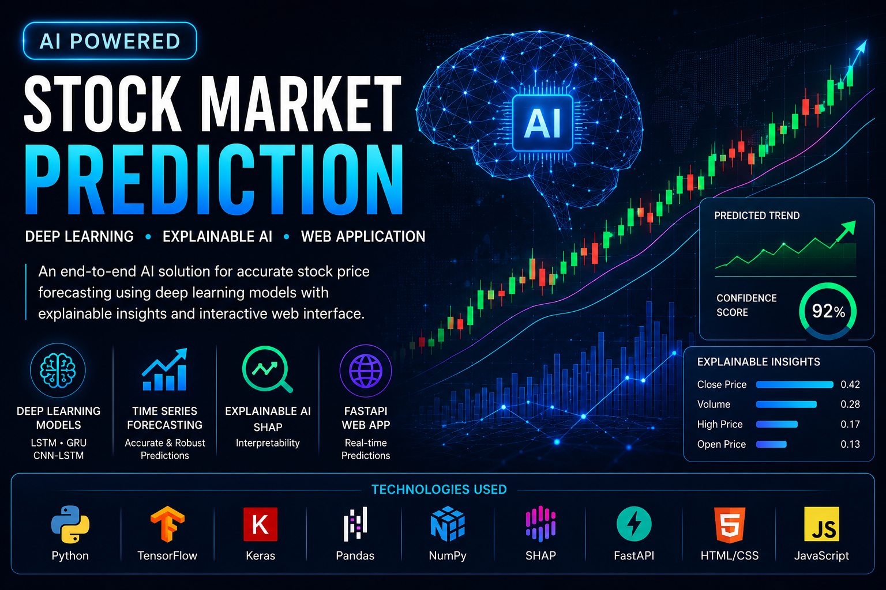
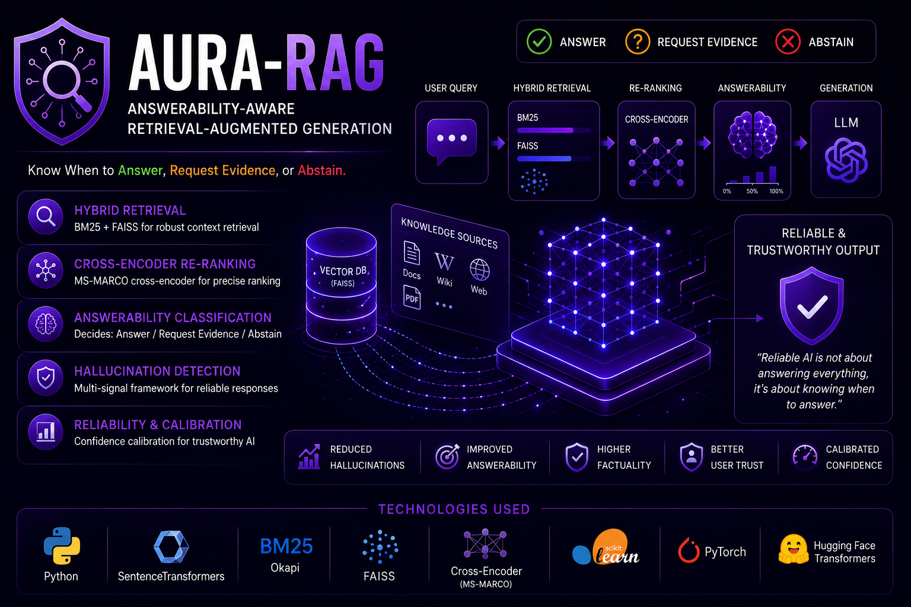
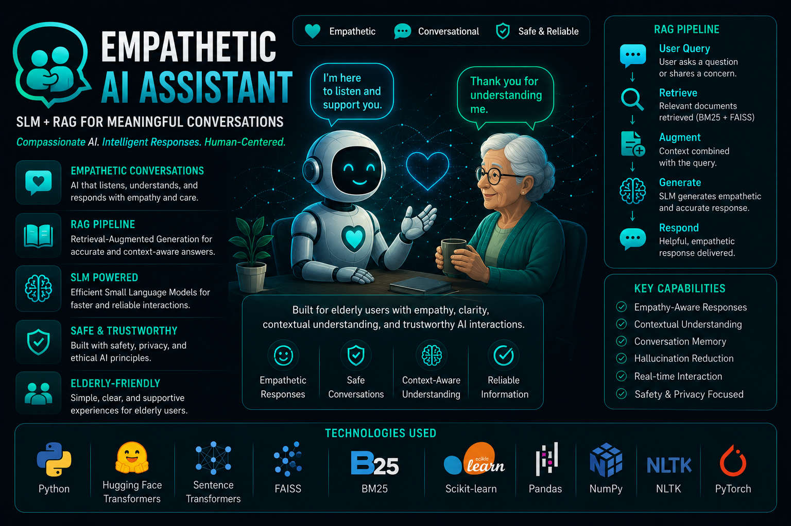
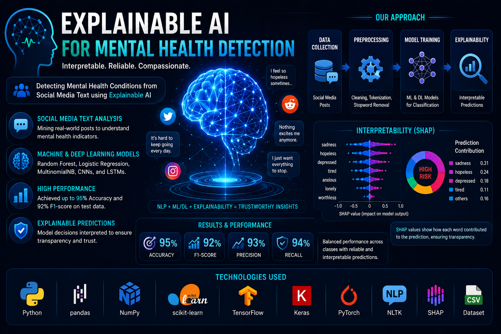
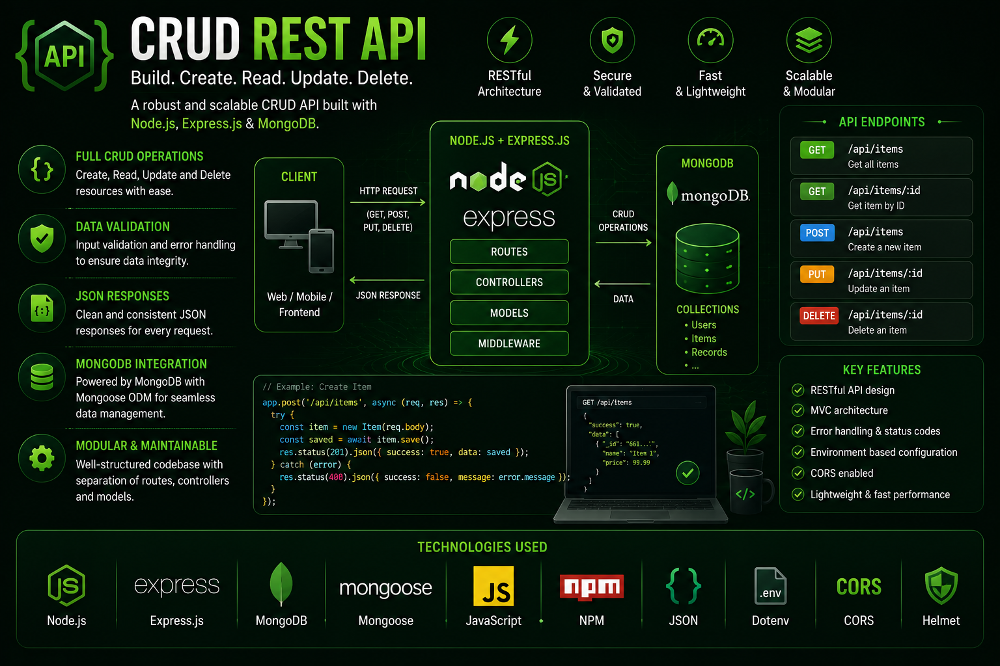

<!-- ========================================================= -->
<!--                  GitHub Profile README                    -->
<!--                     Part 1 : Hero                         -->
<!-- ========================================================= -->

  

# Bijoy Bhadra

### AI Engineer • Machine Learning Engineer • Generative AI Enthusiast

 

---
<!-- ========================================================= -->
<!--                Part 2 : Profile Snapshot                  -->
<!-- ========================================================= -->

## 👨‍💻 Profile Snapshot

<table>
<tr>

<td width="50%" valign="top">

### 🚀 About Me

- 🤖 AI Engineer passionate about building intelligent and reliable AI systems
- 🧠 Focused on Machine Learning, Deep Learning & Generative AI
- 🔍 Interested in Retrieval-Augmented Generation (RAG) and Explainable AI
- 🌱 Continuously exploring modern AI architectures and research

</td>

<td width="50%" valign="top">

### 🎯 Currently

- 🔭 Developing AI-powered applications
- 📚 Exploring Agentic AI & Large Language Models
- 💡 Building reliable and explainable AI solutions
- 🤝 Open to AI/ML collaborations and opportunities

</td>

</tr>
</table>

 

> *"Building AI that is not only intelligent, but also reliable, explainable, and impactful."*

---
<!-- ========================================================= -->
<!--                  Part 3 : Tech Stack                      -->
<!-- ========================================================= -->

## 🛠️ Tech Stack

| Category | Technologies |
|:---------:|:------------|
| **💻 Languages** |  |
| **🤖 AI & ML** |   |
| **🧠 Generative AI** | 🤗 Transformers • Sentence Transformers • RAG • FAISS • BM25 |
| **⚙️ Backend** |  |
| **🛠️ Tools** |  |
| **📊 Data & Visualization** | Pandas • NumPy • Matplotlib • Jupyter Notebook |

---
<!-- ========================================================= -->

<!--               Part 4 : Featured Projects                  -->

<!-- ========================================================= -->

## 🚀 Featured Projects

<table>
<tr>

<td align="center" width="50%">

### 📈 AI Powered Stock Prediction

Deep Learning-based stock forecasting with Explainable AI.

</td>

<td align="center" width="50%">

### 🛡️ AURA-RAG

Answerability-aware Retrieval-Augmented Generation framework.

</td>

</tr>

<tr>

<td align="center">

### 🤖 Empathetic AI Assistant

SLM-powered conversational AI with Retrieval-Augmented Generation.

</td>

<td align="center">

### 🧠 Mental Health Detection

Explainable NLP system using SHAP for transparent predictions.

</td>

</tr>

<tr>

<td align="center">

### 🌐 CRUD REST API

RESTful backend API built with Node.js, Express.js & MongoDB.

</td>

<td align="center">

### 🚀 More Projects

Explore my repositories for additional AI, Machine Learning, Deep Learning, and Backend Development projects.

</td>

</tr>

</table>

---
<!-- ========================================================= -->

<!--           Part 5 : GitHub Analytics & Highlights          -->

<!-- ========================================================= -->

## 📊 GitHub Analytics

 

---

## 🏆 Highlights

* 🤖 Building AI applications with **Machine Learning**, **Deep Learning**, and **Generative AI**
* 🔍 Developed multiple research-oriented AI projects, including **AURA-RAG** and **AI Powered Stock Prediction**
* 🧠 Strong interest in **LLMs**, **RAG**, **Explainable AI**, and **Time-Series Forecasting**
* 🌐 Experience developing scalable backend services using **FastAPI**, **Node.js**, and **REST APIs**
* 🎓 B.Tech in Computer Science & Technology
* 🔬 Completed an AI/ML Research Internship and actively building an open-source AI portfolio

---
<!-- ========================================================= -->

<!--                Part 6 : Connect & Footer                  -->

<!-- ========================================================= -->

## 🤝 Let's Connect

 

---

### ⭐ *"Turning ideas into intelligent, reliable, and impactful AI solutions."*

Thanks for visiting my profile!

If you find my projects interesting, consider ⭐ starring a repository or connecting with me.

<!-- ========================================================= -->

<!--                     End of README                         -->

<!-- ========================================================= -->
